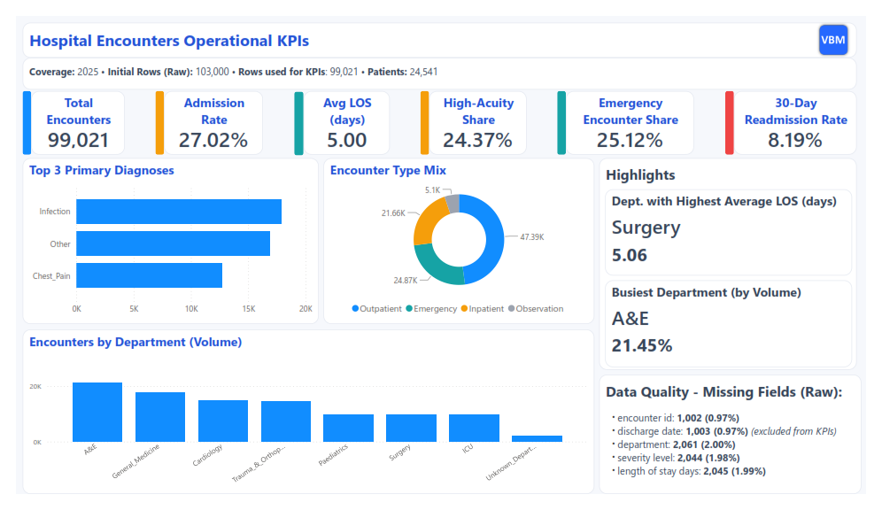

# Verulam Blue — Hospital Encounters (2025) | Operational KPI Findings

   

**Executive Summary:** [Verulam Blue](https://verulamblue.com/) was engaged to validate, clean, and transform an anonymised 2025 acute care encounters dataset for a mid-sized NHS-style hospital in the UK. In response to the brief—and following the loss of the original data engineering team—we remediated documented data quality issues, established an analysis-ready reporting foundation, and delivered a standard set of operational KPIs surfaced through an operational dashboard to support ongoing performance monitoring. This report presents the validated KPI findings.

**Deliverables (client-ready outputs):**
- **Operational dashboard** summarising activity, admissions, length of stay, acuity, emergency pressure, departmental performance, diagnoses, and readmissions
- **Cleaned, analysis-ready encounters dataset** suitable for repeatable reporting
- **Ten operational KPIs** calculated to the brief and produced in a stable results table

**2025 Coverage (post-cleaning):**
- Initial rows (raw extract): **103,000**
- Cleaned encounters for KPI analysis: **99,021**
- Unique patients: **24,541**

**Headline Findings (2025):**
- **Admission Rate:** **27.0%** of encounters result in admission
- **Length of Stay (admitted):** **5.0 days** average (**median: 5.0 days**)
- **Readmissions:** **8.2%** 30-day readmission rate (admitted cohort)
- **Acuity:** **24.4%** of encounters classified as high-acuity (High/Critical)
- **Emergency Care:** **25.1%** of encounters are Emergency
---

## 1) Engagement Summary
**Goal:** take a noisy acute care encounters extract and make it reliable for operational reporting:
- validate and clean the 2025 extract
- apply clear rules and quality checks
- publish stable analysis-ready tables
- generate a repeatable KPI output used by the dashboard

---

## 2) Deliverables

### Published outputs
- **silver_encounters_final** — cleaned, standardised encounters (all years)
- **gold_encounters_final** — 2025 subset + helper flags for KPI logic
- **kpi_results** — consolidated KPI output table: `(kpi_name, kpi_value, kpi_key)`

### Documentation runbook (the “delivery pack”)
- Production setup + step-by-step run instructions:
  - [`docs/production/00_overview.md`](./docs/production/00_overview.md)

---

## 3) Dataset & Key Fields (summary)
Each row represents one encounter for a patient.

Core fields:
- Identifiers: `encounter_id`, `patient_id`
- Dates: `encounter_date_txt`, `admission_date_txt`, `discharge_date_txt` (arrive as DD-MM-YYYY text)
- Categories: `encounter_type`, `department`, `severity_level`, `primary_diagnosis`
- Operational: `length_of_stay_days`

---

## 4) Data Quality Issues Addressed (summary)
- **Duplicates:** deterministic deduplication using business keys + stable tie-break
- **Dates as text:** safe parsing; invalid dates become NULL (pipeline doesn’t break)
- **Missing identifiers:** generate synthetic `encounter_id` only after dedupe
- **Inconsistent categories:** seed-driven mappings to controlled output sets
- **Guardrails:** invalid discharges excluded from LOS/readmission logic

---

## 5) KPI Framework (summary)
All KPIs land in **kpi_results**:
- `kpi_name` — KPI identifier
- `kpi_value` — stored as text for export + dashboard wiring
- `kpi_key` — optional dimension key (dept/diagnosis)

Includes:
- volume + admission rate
- LOS (avg/median)
- acuity + emergency share
- busiest dept + dept with highest avg LOS
- top 3 diagnoses
- 30-day readmission rate

---

## 6) How to Run (pointer)
Start here (prereqs + exact commands + run order):
- **Production runbook:** [`docs/production/00_overview.md`](./docs/production/00_overview.md)

*Don't have Fabric access? A browser-only practice version of this challenge is available on [`Verulam Blue Mint`](https://verulamblue.com/) — see Section 8 for details.*

---

## 7) Assumptions, Limitations, and Access Options

### Assumptions & Limitations

- **Reporting scope:** KPI reporting is restricted to **encounters in the 2025 calendar year** (the cleaned “gold” layer applies this filter).
- **LOS and readmissions cohort rules:** Encounters with **missing or invalid discharge dates** are excluded from **length-of-stay** and **30-day readmission** calculations (because spell logic requires valid admission/discharge dates).
- **Synthetic encounter IDs:** Where `encounter_id` is missing, a **deterministic synthetic ID** is generated for analytics repeatability. These IDs are **not** intended for clinical or operational systems-of-record.
- **Business rules are brief-driven:** Allowed values and mappings (department, encounter type, severity, diagnosis groupings, readmission logic) follow the **project brief**. If the brief changes, outputs will change.
- **Dataset boundaries:** This is an **anonymised, single-extract dataset** designed to be realistic and messy, but it is still a bounded sample. Results should not be treated as benchmarking or representative of all providers.
- **Scale/performance:** The pipeline is designed around **~100k annual encounters**. Significantly larger volumes may require performance tuning (model materialisations, indexing strategies in the warehouse/lakehouse, and incremental patterns).

---

## 8) Implementation Alternatives & Resources

### Browser-Based Practice Version

For learning, assessment, or environments without Microsoft Fabric access, this same hospital encounters challenge is available on [**Verulam Blue Mint (VBM)**](https://verulamblue.com/).

**On VBM you can:**

- work through the same messy healthcare encounters dataset,
- implement the cleaning steps and KPI outputs end-to-end,
- and **validate results automatically** against reference outputs (useful for learning, assessment, and regression checking).

This GitHub repository documents the **production-style Fabric + dbt implementation**, while VBM provides an accessible route to **practice and verification** without requiring a Fabric environment.

---

## 9) Contact & Enquiries

This project is part of **Verulam Blue Mint** — a browser-based platform for practising and assessing real-world data skills on **messy, production-style datasets** [[Link]](https://verulamblue.com/).

Verulam Blue Mint focuses on:
- **End-to-end pipelines, not toy examples** — SQL, dbt, and PySpark workflows built around realistic data quality issues, business rules, and KPI outputs  
- **Auto-validated tasks and KPIs** — results are checked against reference outputs for fast feedback and repeatability  
- **Portfolio-ready projects** — work that’s credible as a GitHub case study and interview story  

**For consultancy enquiries, platform access, or to discuss similar healthcare / operational analytics work, please visit:**

  

